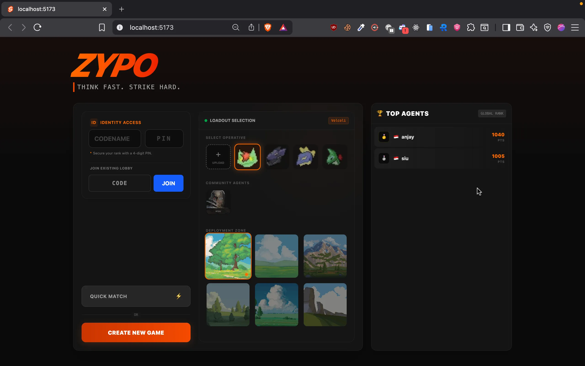
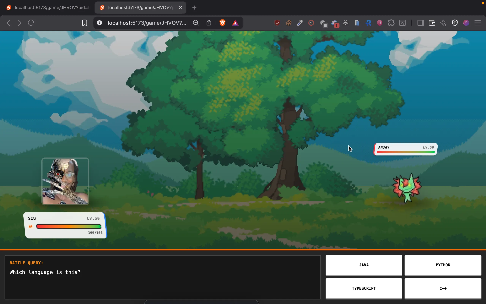

# Zypo 🎮

**Zypo** is a real-time multiplayer game built with modern web technologies, designed for fast-paced action and instant fun.




## 🚀 Key Features

- **Real-time Multiplayer**: Powered by Convex for instant updates and synchronized gameplay.
- **Lobby System**: Create or join game rooms with unique codes.
- **Global Leaderboard**: Compete with players worldwide and see country flags on the leaderboard.
- **Map Selection**: Choose from different battle environments.
- **Responsive Design**: Optimized for both desktop and mobile play.

## 🛠️ Tech Stack

- **Framework**: [SvelteKit](https://kit.svelte.dev/)
- **Backend**: [Convex](https://convex.dev/) (Real-time database & functions)
- **Styling**: [TailwindCSS](https://tailwindcss.com/)
- **State Management**: Svelte Stores & Convex Reactivity

## 📦 Getting Started

Follow these steps to set up the project locally:

1.  **Clone the repository:**

    ```bash
    git clone https://github.com/yourusername/zypo.git
    cd zypo
    ```

2.  **Install dependencies:**

    ```bash
    npm install
    # or
    bun install
    ```

3.  **Start the Convex backend:**
    This will initialize your Convex project and keep the backend functions running.

    ```bash
    npx convex dev
    ```

4.  **Start the development server:**
    Open a new terminal window and run:

    ```bash
    npm run dev
    # or
    bun run dev
    ```

5.  **Open the app:**
    Visit `http://localhost:5173` in your browser.

## 🤝 Contributing

Contributions are welcome! Feel free to open issues or submit pull requests.

## 📄 License

This project is open-source.
